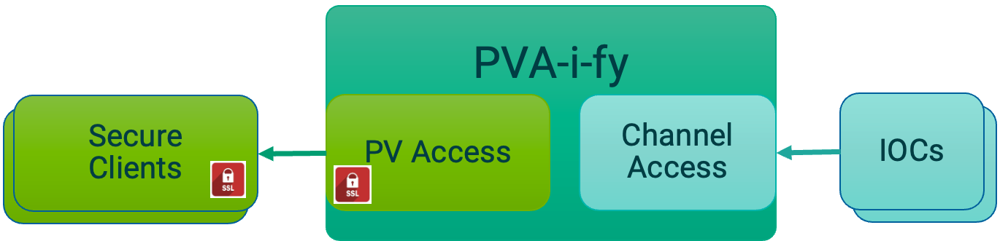
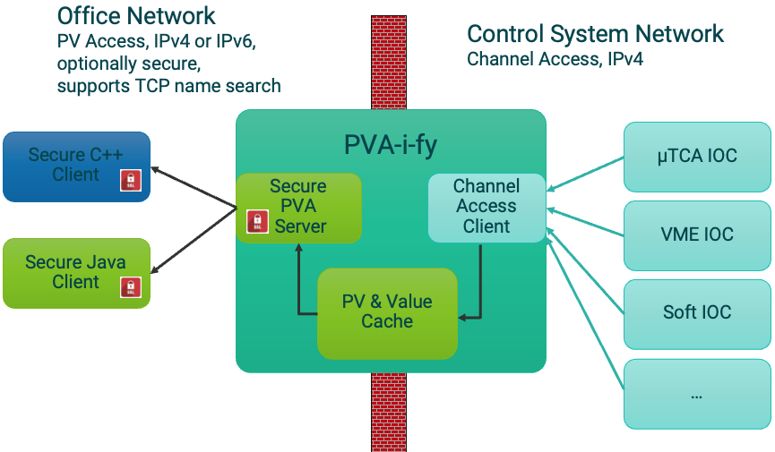

PVA-i-fy
========

Prototype of a proxy that allows reading Channel Access (CA) PVs via PV Access (PVA).



The key use case is an established control system based on CA.
A transition to PVA is desired, but will take time.
Some devices will require a complete replacement.
This proxy makes the control system information available
on a different network via PVA.

PVA-i-fy runs on a host that has access to the two networks.
On the 'outside' network, PVA-i-fy acts as a PVA server,
detecting searches from PVA clients.
It turns these into CA searches on the 'inside' network,
then provides the data received from CA as PVA PVs.

 1. PVA client searches for PV.
 2. The PVA server side of PVA-i-fy receives that search.
    PVA-i-fy does not reply to the search, yet,
    since it knows nothing about the PV.
 3. PVA-i-fy creates CA client PV.
 4. CA client PV connects to IOC, gets first sample.
 5. PVA-i-fy creates PVA server PV with that sample as initial value.
 6. PVA server replies to the search request.
    In the meantime, the client may have issued another search.
    Since the PVA server is now aware of that PV, it will reply right away.
 7. PVA client sees the search reply, connects to PVA server, subscribes, gets initial value.
 8. As the CA client PV receives value updates,
    PVA-i-fy forwards them by updating the associated PVA server PV.

Protected by a firewall, the inner control system network can continue to use CA
during the potentially long update to EPICS 7 and PVA.



On the outside network, PVA is prepared for IPv6 as well as Transport Layer Security (TLS)
to support today's network requirements.
The proxy is for now read-only and TLS authentication may not seem necessary,
but by introducing TLS now, outside clients are prepared to eventually adding
authenticated and authorized write access.


PVA-i-fy Binary
---------------

Fetch https://controlssoftware.sns.ornl.gov/css_phoebus/nightly/pvaify.zip
and unzip.

To run, you need a recent JDK, for example from https://jdk.java.net/archive


Building PVA-i-fy
-----------------

The proxy relies on the CA client library,
the core PVA library and the phoebus PV pool.
To use the latest PVA and PV pool
sources, compile them locally: 

```
git clone https://github.com/ControlSystemStudio/phoebus.git
cd phoebus
mvn -DskipTests=true clean install
cd ..
```

Then build the proxy:

```
git clone https://github.com/ControlSystemStudio/pvaify.git
cd pvaify
mvn -DskipTests=true clean package 
```

For distribution, zip the relevant components:

```
./zip.sh
```


Running PVA-i-fy
----------------

Check `pvaify.ini` for settings related to CA client side of proxy,
PVA server side of proxy, and overall proxy settings.

```
./pvaify.sh -settings demo/pvaify.ini
```


Configuring clients to use PVA-i-fy
-----------------------------------

Clients other than CS-Studio tend to use the following environment variables.

Configure an explicit address list that points to PVA-i-fy:

```
export EPICS_PVA_AUTO_ADDR_LIST=NO
export EPICS_PVA_ADDR_LIST="IP-OF-PVA-i-fy-host"
```

The PVA ADDR LIST uses a UDP search, as is the case
with the corresponding channel access address list.
Alternatively, perform the PVA search via TCP:

```
export EPICS_PVA_AUTO_ADDR_LIST=NO
export EPICS_PVA_ADDR_LIST=
export EPICS_PVA_NAME_SERVERS="IP-OF-PVA-i-fy-host:5075"
```

To use secure PV Access, refer to  
https://github.com/ControlSystemStudio/phoebus/blob/master/core/pva/TLS.md
to prepare the necessary certificate files.

To stay with the UDP name search but then
use secure PVA (TLS) instead of plain TCP connection
for the data transfers, add a client certificate:

```
export EPICS_PVA_AUTO_ADDR_LIST=NO
export EPICS_PVA_ADDR_LIST="IP-OF-PVA-i-fy-host"
export EPICS_PVA_TLS_KEYCHAIN=~/.config/pva/1.3/client.p12
```

When combining secure PVA with `EPICS_PVA_NAME_SERVERS`,
the IP address needs to be prefixed with `pvas://` and point
to the TLS port of the server, by default 5076:

```
export EPICS_PVA_AUTO_ADDR_LIST=NO
export EPICS_PVA_ADDR_LIST=
export EPICS_PVA_NAME_SERVERS="pvas://IP-OF-PVA-i-fy-host:5076"
export EPICS_PVA_TLS_KEYCHAIN=~/.config/pva/1.3/client.p12
```

Then run PVA clients as usual:

```
pvaclient monitor SomePVName
pvxmonitor SomePVName
```

For CS-Studio, the optional `EPICS_PVA_TLS_KEYCHAIN` is set
via the environment as shown above. The remaining parameters
are typically not passed via environment variables but a preference file
which also sets the default PV type to `pva`. See `demo/css_pva.ini` for an example:

```
# Optionally enable secure PVA
export EPICS_PVA_TLS_KEYCHAIN=~/.config/pva/1.3/client.p12
# Remaining settings are in css_pva.ini
phoebus.sh -settings /path/to/pvaify/demo/css_pva.ini
```


Proxy Status PVs
----------------

The proxy provides the following status PVs, where
`$(P)` is the prefix provided via the preference setting

```
org.phoebus.pvaify/prefix=proxy:
```

| Proxy Status PV         | Description                                                |
| ----------------------- | ---------------------------------------------------------- |
| `$(P):pvtotal`          | Total number of proxied PVs                                |
| `$(P):connected`        | Number of PVs with client side connection to CA server/IOC |
| `$(P):unconnected`      | Number of PVs with no CA client connection                 |
| `$(P):existTestRate`    | Rate of search requests received by PVA server side        |
| `$(P):clientEventRate`  | Rate of value updates received by CA client side           |
| `$(P):serverPostRate`   | Rate of value updates emitted by PVA server side           |
| `$(P):clients`          | Table of PVA clients connected to this proxy               |
| `$(P):listDisconnected` | RPC PV that returns list of disconnected channels          |

The `demo` folder contains an example display.


Controlling which PVs are Proxied
---------------------------------

By default, the proxy will try to mirror any PV name.
You may want to control which PVs a proxy handles and which it ignores.
For example, you may want to run a designated proxy that only
mirrors vacuum PVs, identified by PV names that start with "Vac:...".
See `demo/pvaify.pvlist` for details. 


Internals
---------

On its client side, PVA-i-fy uses the CS-Studio PV pool,
which fundamentally supports not only `ca://` but also
`sim://`, `mqtt://`, even `pva://`.
The main purpose of PVA-i-fy is the proxy from CA to
PVA, so `ca://` is configured as the default PV Pool prefix
of the PVA-i-fy  client side.
When the proxy receives a request for the PVA PV `XYZ`,
it will map that to the CA PV `XYZ`.


Implementation Progress
-----------------------

- [x] Proof of principle:
      Create PV with initial value on first client access,
      update monitored value, time, alarm for 'double'
- [x] Dispose PVs that no longer have a client
- [x] pom.xml
- [X] Basic status PVs
- [X] Clean ProxiedPVs which are disconnected on CA side and PVA client is gone as well
- [X] Handle value updates for Double, Number (int/short/byte), String, Enum,
      Array of byte/short/int/float/double
- [X] Optional throttling of updates received on client side
- [X] Example for secure PVA client to proxy's server side
- [X] Use UDP search, then secure TLS connection
- [X] Use `EPICS_PVA_NAME_SERVERS=IP.OF.HO.ST` to search and then read via TCP
      by setting `EPICS_PVA_AUTO_ADDR_LIST=NO`
- [X] Use `EPICS_PVA_NAME_SERVERS='pvas://IP.OF.HO.ST'` to search and then read via TLS
      by setting `EPICS_PVA_AUTO_ADDR_LIST=NO` and
      `EPICS_PVA_TLS_KEYCHAIN=$HOME/.config/pva/1.3/client.p12`
- [X] `pvlist` file to block PV names and/or client hosts
- [X] Indicate read-only state (with PVA prototype that provides this info)
- [X] Unify config into phoebus preferences (-settings my_settings.ini)
- [ ] Favor scalar updates over array updates?
- [ ] Update monitored value for more data types, including display info etc.
- [ ] Is there a practical way to turn the CA waveforms and scalars for an areadetector
      image into a PVA image?
- [X] Basic global on/off write access
- [ ] Dynamic write access that reflects if CA PV is writable
- [ ] Write access rules for controlled write access
- [ ] As control system devices start to directly support PVA and a PVA gateway is added,
      how could PVA-i-fy coexist with a PVA gateway?
      PVA-i-fy needs to ignore PVs available on PVA gateway and vice versa!
      This can be accomplished via the `pvlist` file, but is there a more practical way?
